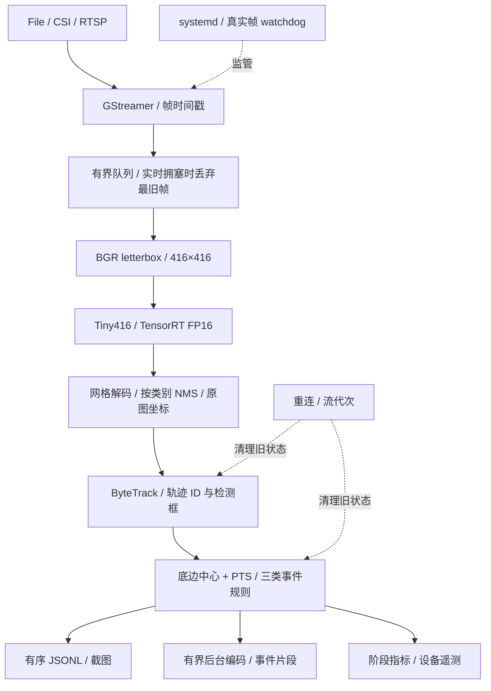

# Jetson 实时跟踪与安全事件分析系统

[](https://github.com/Nefelibata134/jetson-realtime-tracking-system/actions/workflows/ci.yml)
[](LICENSE)

面向 NVIDIA Jetson Orin Nano 的单路 C++17 行人跟踪与事件分析系统。
以 **YOLOX-Tiny416 + TensorRT FP16 + ByteTrack** 为部署主线，将视频转换为带轨迹身份、
触发时间和证据路径的 **ROI 入区、有限线穿越、停留** 事件。支持文件、IMX219 CSI 和
H.264 RTSP 输入，长期服务只保存事件日志、截图与片段，无需全程录像。

当前已部署 Tiny416 事件链路，开发短测支持 **CSI 720p、25W 动态调频下约30 FPS**。
这是运行性能证据，不是事件准确率或长期稳定性验收结论。历史与未采用模型集中在
[模型评估索引](docs/benchmarks/model_evaluation_index.md)，不参与当前默认服务。

[当前部署](#当前部署) · [数据流与实现](#运行时架构) · [实测证据](#实测与模型选择) ·
[快速开始](#jetson-快速开始) · [服务运维](docs/operations/headless_service.md)

## 当前部署

| 项目 | 当前配置 |
| --- | --- |
| 平台 | Jetson Orin Nano 8GB；已记录软件基线见下方，部署时须核对目标设备 |
| 检测器 | YOLOX-Tiny，静态输入 `1×3×416×416`，TensorRT FP16 |
| 服务 engine | `/var/lib/edge-vision/models/yolox_tiny_fp16.plan` |
| CSI 输入 | IMX219 模式 4：1280×720 / 60 FPS 采集 → 30 FPS 交付 |
| 运行策略 | 25W / 动态调频；服务不自动切功率或执行 `jetson_clocks` |
| 服务阈值 | score 0.30、NMS 0.45、track 0.50、new-track 0.60、match 0.80；track buffer 30 帧 |
| 事件配置 | 实测设备启用 ROI、3秒停留、有限线0.2秒确认与共享片段；基础示例保留兼容行为 |

`416` 是检测网络输入尺寸，不是摄像头分辨率。服务配置与 calibration 评估阈值是不同配置，
不可混用其指标。默认项以[服务配置](deploy/systemd/edge-vision.env.example)和
[启动器](scripts/run_edge_vision_service.sh)为准；仓库默认不证明某台设备当前已经部署成功。
可选[事件证据配置](deploy/systemd/event-evidence.env.example)只保存JSONL、截图和片段，不开启全程录像。
实测设备已完成该配置的程序/参数/engine哈希及新增真实帧核验；这是部署健康检查通过，
不是事件准确率或60分钟稳定性验收通过。见[部署记录与限制](docs/benchmarks/tiny416_event_runtime_25w.md#部署与剩余验证)。

## 运行时架构



### 从视频帧到行人轨迹

1. **采集与排队。** GStreamer 解码并传递帧序号、PTS 和流代次。CSI 将720p/60 FPS采集转换为
   30 FPS交付；实时有界队列拥塞时丢弃最旧待处理帧，优先处理新画面。
2. **Tiny416 推理。** 将原图等比例缩放、右侧/底部补边为416×416，保留 BGR、0–255数值范围，
   转成 `1×3×416×416` 浮点张量；TensorRT 执行目标 Jetson 上构建的 FP16 engine。
3. **检测框还原。** 对 `1×3549×85` 未解码输出进行网格解码，以目标置信度与类别分数乘积筛选，
   按类别执行 NMS，再映射回原图坐标。网络输入缩小不改变事件所用的原图几何。
4. **连续跟踪。** ByteTrack 按类别关联检测框，输出轨迹 ID；事件规则仅处理行人类别。
   ID 是跟踪器分配的临时身份，不是人员识别结果，遮挡与重复检测可能造成身份切换。

对应实现：[预处理](src/yolox_preprocessor.cpp) · [解码与NMS](src/yolox_postprocessor.cpp) ·
[Detector](src/yolox_detector.cpp) · [ByteTrack适配](src/byte_tracker.cpp)。

### 从轨迹到事件证据

规则使用**框底边中心的归一化坐标**和**视频 PTS**，不是脚部关键点或程序处理耗时。
ROI与警戒线必须按实际画面配置；不把检测到一个人直接等同于一次报警。

| 事件 | 判断依据 | 当前部署的抖动抑制 |
| --- | --- | --- |
| ROI入区 | 锚点进入多边形区域，确认状态变化后报警 | 离区边界余量0.02、持续离区0.5秒后允许重新入区报警 |
| 有限线穿越 | 锚点运动轨迹跨过指定线段，并符合方向设置 | 新侧连续观测0.2秒；线段延长线不算穿越 |
| 停留 | 同一轨迹在ROI内满足3秒停留条件 | 使用确认帧与观测间隔限制；断轨或换ID仍可能导致重复计时 |

事件触发后生成截图，利用有界预缓冲保留事件前2秒和后3秒片段；后台采用 x264 编码，
时间重叠的事件可共享片段以减少重复写出。证据完成并验证后，有序发布包含
`event_id`、`track_id`、`pts_ns` 和证据路径的 JSONL，供后续检索和人工复核。
全程标注录像是可选调试/测试输出，当前长期服务不启用。

**可观测与恢复：** 阶段耗时、帧完整性、后台编码与停止flush分别计量，指标原子发布。
watchdog依据真实解码帧增长，而非进程存活；RTSP/CSI重连受次数与超时约束，流代次改变时清除旧轨迹和事件状态。
完整帧质量回放使用独立入口，不与实时丢帧策略混用。

详细接口和 File / CSI / RTSP 命令见[运行与评估手册](docs/runtime_guide.md)。

## 实测与模型选择

### Tiny416：25W 动态调频事件短测

在 CSI 720p、真实人物活动、截图/共享事件片段及全程 x264 标注录像负载下，
300帧预热后测量9000帧：**30.0013 FPS，TRT P95 12.65 ms，E2E P95 23.11 ms**，
正式采集/录像丢帧和序列缺口均为0；预热丢弃7帧单列。
32条事件都有截图，25个物理片段覆盖全部事件。该结果不等于事件准确率或长期稳定性通过：
回顾性复核确认11条错误报警，完整真值不足，未计算事件P/R/F1；该轮未进行60分钟验证。
详见[协议、计时边界与限制](docs/benchmarks/tiny416_event_runtime_25w.md)。
E2E计时到同步事件I/O与视频入队结束，不含传感器曝光、后台编码最终落盘或停止flush；
P95达标也不等于每帧都满足33.33ms截止时间。
长期事件证据配置不启用全程录像，且不以这次短测宣称性能优于旧服务。

### Tiny416规则候选：60分钟事件链路

同一Tiny416 engine、25W动态调频，规则候选r9仅保存事件证据：108600帧、约60分20秒，
**30.00004 FPS，TRT/E2E P95 10.45/18.33 ms，正式丢帧与缺口均0**，结束后恢复原r8服务。
简化运行范围（时长/FPS/保护/恢复）PASS；**原协议因内存峰值增长约508 MiB保持NOT_ACCEPTED**。
11事件的截图/7物理片段留证通过，但无停留事件和完整GT；不等于事件准确率、全部稳定性或默认晋级通过。
详见[配置、判定范围与内存限制](docs/benchmarks/tiny416_event_soak_25w.md)。

### Tiny416 的质量证据与选型依据

Tiny416 的 MOT17 calibration 为 **HOTA 33.31、IDF1 39.80、MOTA 29.65**；
固定留出划分为 **HOTA 38.89、IDF1 46.75、MOTA 39.19**，两种划分不合并。
同轮 CAVIAR development 得到 **4 TP / 2 FP / 5 FN，F1 53.33%**：支持模型选型取舍，
但也说明事件漏报仍存在，不能把检测/跟踪成绩直接当作三类事件准确率。

采用 Tiny416 的依据是已有检测、跟踪、设备运行与部署证据的综合取舍，不是所有指标均最优。
详细协议与结果见 [MOT17](docs/benchmarks/mot17_tracking_results.md)、
[CAVIAR开发对照](docs/benchmarks/caviar_detector_development_comparison.md)；
其他模型、输入尺寸、功率条件与失败实验统一保留在[模型评估索引](docs/benchmarks/model_evaluation_index.md)。

## Jetson 快速开始

适用于已具备匹配 CUDA/TensorRT 的目标 Jetson。先核对软件栈与依赖安装计划；不要用系统升级代替应用依赖配置。
在全新部署中获取已校验的 Tiny416 ONNX，再在目标设备构建 engine：

```bash
sudo apt-get update
sudo apt-get install -y \
  git curl cmake g++ pkg-config libopencv-dev libeigen3-dev nlohmann-json3-dev \
  libgstreamer1.0-dev libgstreamer-plugins-base1.0-dev \
  gstreamer1.0-plugins-good gstreamer1.0-plugins-bad \
  gstreamer1.0-plugins-ugly gstreamer1.0-tools

git clone https://github.com/Nefelibata134/jetson-realtime-tracking-system.git
cd jetson-realtime-tracking-system

bash scripts/fetch_yolox_tiny.sh
bash scripts/build_tensorrt_engine.sh \
  models/yolox_tiny.onnx models/yolox_tiny_fp16.plan

cmake -S . -B build \
  -DCMAKE_BUILD_TYPE=Release \
  -DEDGE_VISION_ENABLE_GSTREAMER=ON \
  -DEDGE_VISION_ENABLE_TENSORRT=ON
cmake --build build -j"$(nproc)"
ctest --test-dir build --output-on-failure
```

执行一次有限 IMX219 验证并原子发布指标。已运行摄像头服务时，不要同时启动第二个 CSI 进程；
应先安排停服与退出恢复窗口。此命令仅验证基础链路，不启用事件规则或媒体输出：

```bash
./build/edge_vision_realtime_detect \
  --engine models/yolox_tiny_fp16.plan \
  --csi --sensor-id 0 --sensor-mode 4 \
  --capture-width 1280 --capture-height 720 --capture-fps 60 \
  --width 1280 --height 720 --fps 30 \
  --warmup-frames 30 --frames 300 --queue-capacity 2 \
  --score-threshold 0.3 \
  --track-threshold 0.5 --new-track-threshold 0.6 --track-buffer 30 \
  --metrics-json outputs/metrics/imx219.json
```

TensorRT plan 与硬件及软件栈耦合，不从其他设备直接复制使用。正式服务安装、环境配置、
启停与恢复见[服务运维指南](docs/operations/headless_service.md)；完整事件与媒体命令见
[运行手册](docs/runtime_guide.md#构建与运行)。切换 engine 后应核对实际进程参数、文件哈希、
服务状态、重启计数及新增真实帧，不能只凭 `active` 判断完成。

## 模型资产

当前 Tiny416 使用校验过的官方 ONNX，在目标 Jetson 上构建独立 FP16 engine；
来源、SHA-256 与输入输出契约见[模型元数据](models/yolox_tiny.json)。
获取入口为 `scripts/fetch_yolox_tiny.sh`，构建步骤见上方快速开始。

仓库只跟踪获取/导出/构建工具、元数据与校验和，不分发权重、ONNX 或 engine。
历史与候选资产入口见[模型评估索引](docs/benchmarks/model_evaluation_index.md#模型资产与复现入口)，
其代码与历史结果保留，不改变默认服务。

## 已知限制与验收缺口

- **事件质量：** 背景误检、遮挡、框底边抖动与同一人物换ID，可能造成重复入区、重复停留或漏报。
  跟踪ID去重不能解决跨ID的同一人物重复报警；当前不宣称三类事件准确率通过。
- **部署一致性：** 需要在最终服务阈值和场景规则下，完成真实三类事件负载的 CSI 720p/30 完整输出验证。
- **长期运行：** 规则候选已完成60分钟运行，但原内存门槛未通过；最终部署配置与故障注入验证仍需单独核验。
- **证据边界：** 回放速度不替代 CSI FPS；缺失的 E2E 或事件 I/O 保持 N/A，不从阶段 P95 相加推算。
- **公开资产：** 视频、截图、标注、逐帧输出、运行日志、模型与凭据不纳入 Git。
  运行产物写入 `outputs/` 或服务 spool，按场景授权和保留策略管理。

## 文档与验证入口

| 需求 | 入口 |
| --- | --- |
| 构建、File / CSI / RTSP、事件与编码参数 | [运行与评估手册](docs/runtime_guide.md) |
| systemd、spool、日志和真实帧 watchdog | [服务运维](docs/operations/headless_service.md) · [恢复验证](docs/operations/stability_validation.md) |
| 指标定义、事件格式和证据时序 | [运行指标 Schema](docs/metrics/runtime_metrics_schema.md) · [事件 Schema](docs/events/event_schema.md) |
| MOT17 固定划分与 TrackEval | [协议](docs/benchmarks/mot17_evaluation_protocol.md) · [结果](docs/benchmarks/mot17_tracking_results.md) |
| CAVIAR 冻结规则和历史外部验证 | [协议](docs/benchmarks/caviar_external_validation_protocol.md) · [结果](docs/benchmarks/caviar_external_validation_results.md) |
| 架构、模型与功率取舍 | [工程决策](docs/decisions.md) |
| 变更与发布边界 | [CHANGELOG](CHANGELOG.md) · [第三方声明](THIRD_PARTY_NOTICES.md) |

已记录目标软件基线：JetPack 6.2.1 / Ubuntu 22.04、CUDA 12.6 / TensorRT 10.3、
C++17 / CMake 3.22+、OpenCV 4.5+、GStreamer 1.20+。实际设备版本需部署时核验。
主机可执行 CTest 与 Python 确定性检查，但不覆盖目标 TensorRT 链接、设备推理或 CSI 性能。

## 许可证

从许可证迁移提交开始，项目自有源码及包含兼容第三方组件的整体项目分发按
[`AGPL-3.0-only`](LICENSE)（GNU Affero General Public License v3.0 only）提供，
并须满足其相应源码提供与分发义务。第三方文件本身未被重新许可，原始许可证和版权声明
继续保留；这不豁免整体组合程序的 AGPL 发布条件。
截至并包括提交 `d790926b0187d27b1f5f5607f1ef709c909eaf7f` 的历史版本仍按其当时的
MIT License 授权，既有授权不作追溯变更。范围、源码提供义务和二进制发布边界见
[许可证与发布边界](docs/licensing.md)，第三方组件及资产的原始许可见
[第三方声明](THIRD_PARTY_NOTICES.md)。

CUDA/TensorRT 等外部专有依赖不随本仓库分发。未来发布项目二进制、容器或捆绑运行库前，
必须重新审计实际组合及其许可兼容性；当前源码发布不构成二进制分发授权。
