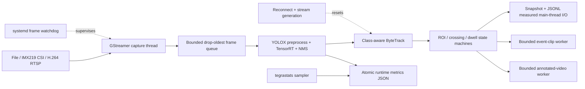

# Jetson Realtime Tracking System

[](https://github.com/Nefelibata134/jetson-realtime-tracking-system/actions/workflows/ci.yml)
[](LICENSE)

A production-oriented C++17 edge video analytics runtime for NVIDIA Jetson.
It ingests file, IMX219 CSI, or H.264 RTSP video; runs YOLOX with TensorRT;
maintains class-aware ByteTrack identities; evaluates ROI, line-crossing, and
dwell rules; and persists auditable event evidence with measured synchronous
I/O and bounded asynchronous encoders.

## Measured On Jetson

The complete pipeline includes capture, detection, tracking, safety rules,
event screenshots and clips, annotated video, metrics, and device telemetry.
All figures below were measured on a Jetson Orin Nano 8GB with locked clocks.

| Configuration | Audit encoder | FPS | Capture drop | TRT P95 | E2E P95 | Video written | Mean input power |
| --- | --- | ---: | ---: | ---: | ---: | ---: | ---: |
| 720p, 25W | MP4V | 30.03 | 0.00% | 3.53 ms | 9.99 ms | 600/600 | 8.69 W |
| 720p, MAXN_SUPER | MP4V | 30.04 | 0.00% | 3.22 ms | 8.46 ms | 600/600 | 9.00 W |
| 1080p, 25W | MP4V | 30.04 | 0.00% | 3.49 ms | 14.17 ms | 280/600 | 8.93 W |
| 1080p, 25W | x264 | 30.00 | 0.00% | 3.75 ms | 13.67 ms | 600/600 | 9.35 W |
| 1080p, MAXN_SUPER | MP4V | 29.99 | 0.00% | 3.24 ms | 12.13 ms | 379/600 | 9.46 W |
| 1080p, MAXN_SUPER | x264 | 29.12 | 0.00% | 6.31 ms | 14.45 ms | 600/600 | 9.92 W |

Additional validation:

- A 60-minute CSI service soak completed with 100% active coverage, zero
  restarts, zero watchdog stalls, zero frame stalls, 30.00 FPS, and 0.00%
  capture drop.
- Controlled SIGKILL and RTSP source-outage tests recovered to real frame
  processing rather than accepting a restarted but idle process.
- The fixed YOLOX-Tiny MOT17 holdout achieved 38.89 HOTA, 46.75 IDF1, and
  39.19 MOTA. This result measures the complete detector-tracker pair.

See the [full pipeline matrix](docs/benchmarks/jetson_full_pipeline_matrix.md),
[MOT17 tracking results](docs/benchmarks/mot17_tracking_results.md), and
[service stability report](docs/operations/stability_report.md) for protocols,
sample counts, and limitations.

The 25W x264 run contained no detections or emitted events; it validates audit
encoding continuity but not active event I/O. The MAXN_SUPER x264 run emitted
both intrusion and dwell evidence while preserving all 600 audit frames.

## Runtime Evidence

A representative live event record and steady-state summary look like:

```text
event=line_crossing rule=directional-crossing track_id=2 class_id=0 frame=131 pts_ms=4366.667
target_reached=true
invalid_frames=0
output_frames=240
output_frames_dropped=0
event_analysis_p95_ms=0.006
end_to_end_p95_ms=15.038
effective_fps=30.093
```

Captured video, snapshots, clips, JSONL journals, and raw metrics are written
under `outputs/` or the configured service spool. These runtime artifacts are
ignored by Git so captured content and device-generated model engines are not
published accidentally.

## Runtime Architecture



The file source provides deterministic replay for regression and benchmark
runs. The IMX219 CSI source is the primary live input. RTSP is used to verify
network-stream reconnect and fault-recovery behavior.

The bounded capture queue protects freshness by dropping the oldest pending
frame during overload. Event-clip and annotated-video encoding run on separate
bounded workers, so software encoding cannot block detection. Snapshot and
JSONL writes remain on the processing thread to preserve publication order;
their cost is reported separately as active event I/O, and slow storage can
increase latency on event frames. Successful source recovery requires a real
decoded frame, increments the stream generation, and clears stale tracking and
event state.

## Quick Start On Jetson

Install build dependencies, fetch the checksum-pinned model, and build its
FP16 TensorRT engine on the target Jetson:

```bash
sudo apt-get update
sudo apt-get install -y \
  git curl cmake g++ pkg-config libopencv-dev libeigen3-dev nlohmann-json3-dev \
  libgstreamer1.0-dev libgstreamer-plugins-base1.0-dev \
  gstreamer1.0-plugins-good gstreamer1.0-plugins-bad \
  gstreamer1.0-plugins-ugly gstreamer1.0-tools

git clone https://github.com/Nefelibata134/jetson-realtime-tracking-system.git
cd jetson-realtime-tracking-system

bash scripts/fetch_yolox_nano.sh
bash scripts/build_tensorrt_engine.sh \
  models/yolox_nano.onnx models/yolox_nano_fp16.plan

cmake -S . -B build \
  -DCMAKE_BUILD_TYPE=Release \
  -DEDGE_VISION_ENABLE_GSTREAMER=ON \
  -DEDGE_VISION_ENABLE_TENSORRT=ON
cmake --build build -j"$(nproc)"
ctest --test-dir build --output-on-failure
```

Run a finite IMX219 validation and atomically publish its metrics:

```bash
./build/edge_vision_realtime_detect \
  --engine models/yolox_nano_fp16.plan \
  --csi --sensor-id 0 --sensor-mode 4 \
  --capture-width 1280 --capture-height 720 --capture-fps 60 \
  --width 1280 --height 720 --fps 30 \
  --warmup-frames 30 --frames 300 --queue-capacity 2 \
  --score-threshold 0.3 \
  --track-threshold 0.5 --new-track-threshold 0.6 --track-buffer 30 \
  --metrics-json outputs/metrics/imx219.json
```

TensorRT plan files are hardware- and software-coupled artifacts and must be
built on the deployment Jetson. See [Model Artifacts](#model-artifacts) and
the [service operations guide](docs/operations/headless_service.md) before
installing continuous unattended operation.

## Components

| Component | Responsibility | Status |
| --- | --- | --- |
| Runtime contracts | Frame, source, detector, and detection types | Implemented |
| GStreamer source | File replay, IMX219 CSI capture, and H.264 RTSP ingestion | Implemented |
| Capture pipeline | Dedicated producer thread, bounded queue, timestamps, and drop-oldest backpressure | Implemented |
| TensorRT runtime | Engine loading, CUDA buffers, and execution | Implemented |
| YOLOX detector | Preprocessing, TensorRT execution, grid decoding, confidence filtering, and NMS | Implemented |
| Continuous detection and tracking | Capture, bounded latest-frame queue, TensorRT detection, ByteTrack association, annotated video output, and latency statistics | Implemented |
| Benchmark harness | Warmup isolation, power telemetry, and model/resolution/power comparison | Implemented |
| ByteTrack | Kalman prediction, two-stage association, class-aware identities, and reset semantics | Implemented |
| Event analyzer | Confirmed ROI intrusion, finite directional crossing, timestamp dwell, and stream reset | Implemented |
| Event evidence | Versioned JSONL journal, persistent deduplication, snapshots, and bounded pre/post-event clips | Implemented |
| Telemetry | Versioned pipeline metrics plus background Jetson utilization, temperature, power, and memory sampling | Implemented |
| Recovery | Bounded CSI/RTSP reconnect, no-frame timeout, stream generations, and explicit failure status | Implemented |
| Service lifecycle | Continuous mode, SIGTERM shutdown, systemd readiness, progress watchdog, and bounded latency window | Implemented |
| Operations | systemd installation, persistent local event spool, retention timer, and log rotation | Implemented |
| Stability validation | Service soak sampling, resource trends, process crash injection, and RTSP outage recovery | Implemented |

## Build

```bash
cmake -S . -B build -DCMAKE_BUILD_TYPE=Release
cmake --build build -j"$(nproc)"
ctest --test-dir build --output-on-failure
./build/edge_vision_contract_check
./build/edge_vision_frame_queue_check
./build/edge_vision_preprocess_check
./build/edge_vision_postprocess_check
./build/edge_vision_byte_tracker_check
```

The default targets require a C++17 compiler, OpenCV, Eigen 3, and
`nlohmann-json3-dev`. TensorRT targets are enabled explicitly for Jetson
builds.

Configure the GStreamer capture targets on Jetson with:

```bash
cmake -S . -B build \
  -DCMAKE_BUILD_TYPE=Release \
  -DEDGE_VISION_ENABLE_GSTREAMER=ON
cmake --build build -j"$(nproc)"

./build/edge_vision_capture_stream \
  --file input.mp4 --frames 300 --queue-capacity 4

./build/edge_vision_capture_stream \
  --csi --sensor-id 0 \
  --sensor-mode 4 \
  --capture-width 1280 --capture-height 720 --capture-fps 60 \
  --width 1280 --height 720 --fps 30 \
  --frames 300 --queue-capacity 4 \
  --reconnect-attempts 3 --reconnect-delay-ms 1000

./build/edge_vision_capture_stream \
  --rtsp rtsp://192.168.1.20:8554/camera \
  --rtsp-transport tcp \
  --rtsp-latency-ms 200 --rtsp-timeout-ms 5000 \
  --width 1280 --height 720 --fps 30 \
  --frames 300 --queue-capacity 4 \
  --reconnect-attempts 3 --reconnect-delay-ms 1000
```

The capture worker runs the source on a dedicated producer thread. Its bounded
queue drops the oldest frame when the consumer falls behind, keeping memory
bounded and prioritizing fresh frames for realtime analytics. Set
`--consumer-delay-ms` to create a controlled overload and inspect queue depth,
dropped frames, sequence gaps, and queue residence time.

A deterministic RTSP endpoint can be created from an H.264 MP4 replay file:

```bash
sudo apt-get install -y python3-gi gir1.2-gst-rtsp-server-1.0
python3 scripts/serve_rtsp_replay.py videos/replay.mp4 \
  --port 8554 --mount /replay
```

The client URI is `rtsp://HOST:8554/replay`, where `HOST` is the server's LAN
address. Stopping and restarting this process creates a controlled network
stream outage without changing the detector or tracker configuration.

The RTSP URI is passed to the runtime as a process argument. Do not embed
long-lived credentials in the URI on a shared host because local process
inspection may expose them; prefer a credential-free local relay or restrict
host access.

CSI capture and application output rates are configured independently. For the
IMX219, the command above selects native sensor mode 4 at 1280x720/60 FPS and
uses `videorate` to deliver 30 FPS to the application. Unexpected EOS triggers
a bounded pipeline reopen sequence. The RTSP source accepts H.264 video over
TCP or UDP; TCP is the default for reliable delivery, while UDP can reduce
transport delay on a controlled network. A no-frame timeout also catches
connections that remain open without delivering decodable frames. The retry
budget, successful-restart count, and stream generation advance only after a
frame is received, so repeated empty reconnects cannot be reported as recovery
or continue indefinitely. If the requested frame count is not reached after
all attempts, the process reports recovery statistics and exits with a nonzero
status.

Configure the TensorRT runtime on Jetson and execute an engine probe with:

```bash
cmake -S . -B build \
  -DCMAKE_BUILD_TYPE=Release \
  -DEDGE_VISION_ENABLE_TENSORRT=ON
cmake --build build -j"$(nproc)"
./build/edge_vision_trt_probe models/yolox_nano_fp16.plan
./build/edge_vision_detect_image \
  models/yolox_nano_fp16.plan input.jpg output.jpg
```

Configure both runtime backends to run continuous detection from a replay file
or the IMX219 camera:

```bash
cmake -S . -B build \
  -DCMAKE_BUILD_TYPE=Release \
  -DEDGE_VISION_ENABLE_GSTREAMER=ON \
  -DEDGE_VISION_ENABLE_TENSORRT=ON
cmake --build build -j"$(nproc)"

./build/edge_vision_realtime_detect \
  --engine models/yolox_nano_fp16.plan \
  --file input.mp4 \
  --warmup-frames 30 \
  --frames 300 \
  --queue-capacity 2 \
  --score-threshold 0.3 \
  --track-threshold 0.5 \
  --new-track-threshold 0.6 \
  --track-buffer 30 \
  --output-video outputs/replay_tracking.mp4 \
  --output-queue-capacity 4

./build/edge_vision_realtime_detect \
  --engine models/yolox_nano_fp16.plan \
  --csi --sensor-id 0 \
  --sensor-mode 4 \
  --capture-width 1280 --capture-height 720 --capture-fps 60 \
  --width 1280 --height 720 --fps 30 \
  --warmup-frames 30 \
  --frames 300 \
  --queue-capacity 2 \
  --score-threshold 0.3 \
  --track-threshold 0.5 \
  --new-track-threshold 0.6 \
  --track-buffer 30 \
  --event-roi 0.20 0.35 0.80 0.95 \
  --event-dwell-seconds 3 \
  --event-line 0.15 0.70 0.85 0.70 \
  --event-line-direction any \
  --event-class-id 0 \
  --event-jsonl outputs/events/events.jsonl \
  --event-snapshot-dir outputs/events/snapshots \
  --event-clip-dir outputs/events/clips \
  --event-clip-pre-seconds 2 \
  --event-clip-post-seconds 3 \
  --output-video outputs/imx219_tracking.mp4 \
  --output-queue-capacity 4 \
  --metrics-json outputs/metrics/imx219_runtime.json \
  --tegrastats-interval-ms 500 \
  --reconnect-attempts 3 --reconnect-delay-ms 1000

./build/edge_vision_realtime_detect \
  --engine models/yolox_nano_fp16.plan \
  --rtsp rtsp://192.168.1.20:8554/camera \
  --rtsp-transport tcp \
  --rtsp-latency-ms 200 --rtsp-timeout-ms 5000 \
  --width 1280 --height 720 --fps 30 \
  --warmup-frames 30 \
  --frames 300 \
  --queue-capacity 2 \
  --score-threshold 0.3 \
  --track-threshold 0.5 \
  --new-track-threshold 0.6 \
  --track-buffer 30 \
  --reconnect-attempts 3 --reconnect-delay-ms 1000
```

The runtime reports produced, processed, and dropped frames; queue depth and
sequence gaps; detection, track, and event counts; unique track IDs;
queue-wait, detector preprocessing, TensorRT execution, detector
postprocessing, tracking, event-analysis, event-output, video-enqueue, and
end-to-end P50/P95 latencies; and effective throughput. The detector score
threshold must remain
below the ByteTrack track threshold so low-confidence detections remain
available for second-stage association. A small queue bounds stale-frame delay
when capture outpaces inference. Missing frame sequences age the tracker with
empty updates, while a successful source reconnect increments the stream
generation and clears all
stale tracks. Warmup frames execute the complete pipeline but are excluded
from detection, tracking, latency, throughput, and steady-state drop
statistics.

`--metrics-json` publishes the final runtime state as a versioned JSON
document. Pipeline counters, drop rate, queue watermark, restart state,
detection/tracking/event totals, output-writer workload, effective FPS, and
stage latency summaries are combined with Jetson telemetry sampled by a dedicated background
`tegrastats` process. Device sampling never runs on the inference thread; if
`tegrastats` is unavailable, pipeline metrics are still written and
`device.available` is `false`. The complete field and unit contract is defined
in the [runtime metrics schema](docs/metrics/runtime_metrics_schema.md).
The measured sampling overhead comparison is recorded in the
[runtime telemetry benchmark](docs/benchmarks/runtime_telemetry_overhead.md).

For unattended operation, `--continuous` removes the finite frame target and
keeps latency memory bounded to the latest `--metrics-window-frames` samples.
SIGINT and SIGTERM request an orderly shutdown: capture stops, pending event
clips and annotated video are finalized, telemetry is stopped, and the final
metrics document is atomically published. Under systemd, the runtime sends
`READY=1`, frame-progress watchdog heartbeats, and `STOPPING=1`. Heartbeats are
withheld when real frames stop arriving, allowing systemd to recover a stalled
capture or inference process rather than accepting an idle event loop as
healthy.

The supported headless installation, persistent state layout, retention
policy, service checks, and log rotation commands are documented in the
[service operations guide](docs/operations/headless_service.md).
Long-running health criteria and repeatable process/source fault injection are
defined in the
[stability and recovery validation guide](docs/operations/stability_validation.md).
Measured one-hour soak and fault-injection results are published in the
[Jetson service stability report](docs/operations/stability_report.md).

Safety rules are opt-in. `--event-roi` defines a normalized rectangular region
as `LEFT TOP RIGHT BOTTOM` and enables confirmed ROI intrusion events.
`--event-dwell-seconds` adds a timestamp-based dwell rule for the same region.
`--event-line` defines a finite normalized segment, while
`--event-line-direction` selects `any`, `negative-to-positive`, or
`positive-to-negative` crossing. `--event-class-id` selects one COCO class and
accepts `-1` to apply the configured rules to every tracked class. Rules use
each track's bottom-center anchor;
stream generation changes and timeline restarts clear all event state.

`--event-jsonl` enables the versioned append-only event journal. Optional
snapshot and clip directories add verified evidence paths to each record.
Snapshots are committed before the record is appended. Event clips use a
bounded raw-frame prebuffer, collect shared frame references on the real-time
thread, and encode completed segments on a bounded background queue. Journal
publication waits until the clip is closed and verified. The runtime reports
journal writes, duplicate skips, artifact counts, event I/O latency, and peak
clip-buffer memory. The complete
record contract and durability semantics are defined in the
[safety event schema](docs/events/event_schema.md).

`--output-video` is optional. When enabled, the runtime sends measured frames
after warmup to a dedicated bounded writer queue and overlays each active
track's bounding box, bottom-center anchor, class ID, confidence, and persistent
track ID. Configured ROI and line geometry remain visible, while triggered
event labels and anchors persist briefly for review. Slow encoding drops the
oldest pending output frame instead of blocking capture, detection, or
tracking. Enqueue latency, writer drops, queue watermark, and final flush time
are reported separately from real-time pipeline latency. Background encoding
total and maximum execution time are also reported; enqueue time alone does
not represent codec or storage cost.

The runtime defaults annotated output to GStreamer `x264enc` with the
`ultrafast` and `zerolatency` profiles, a one-second GOP, no B-frames, one
reference frame, and adaptive quantization disabled. Set the target bitrate
with `--output-bitrate-kbps` (default `10000`). Jetson Orin Nano has no NVENC,
so this path is deliberately tuned CPU H.264. `--output-encoder mp4v` retains
the OpenCV compatibility backend for comparison, but measured 1080p MP4V
throughput is below 30 FPS. The selected encoder and bitrate are recorded in
the runtime log and metrics JSON.

Measured synchronous and asynchronous output results are available in the
[annotated video output benchmark](docs/benchmarks/annotated_video_output.md).

## Jetson Benchmark Matrix

The benchmark harness compares YOLOX-Nano and YOLOX-Tiny under 720p and 1080p
CSI capture in two Jetson power modes. Both detectors retain their fixed
`1x3x416x416` TensorRT input; capture resolution measures the upstream camera,
conversion, resize, and memory-transfer workload rather than changing the
model tensor contract.

Fetch the verified upstream exports, then build both FP16 engines on the target
Jetson:

```bash
bash scripts/fetch_yolox_nano.sh
bash scripts/fetch_yolox_tiny.sh

bash scripts/build_tensorrt_engine.sh \
  models/yolox_nano.onnx models/yolox_nano_fp16.plan
bash scripts/build_tensorrt_engine.sh \
  models/yolox_tiny.onnx models/yolox_tiny_fp16.plan
```

Build the runtime and inspect the power modes available on the device:

```bash
cmake -S . -B build-jetson-benchmark \
  -DCMAKE_BUILD_TYPE=Release \
  -DEDGE_VISION_ENABLE_GSTREAMER=ON \
  -DEDGE_VISION_ENABLE_TENSORRT=ON
cmake --build build-jetson-benchmark -j"$(nproc)"
ctest --test-dir build-jetson-benchmark --output-on-failure

sudo nvpmodel -q --verbose
```

Run one controlled group with the active power mode. Repeat the command for
`nano` and `tiny`, for `720p` and `1080p`, and after selecting each power mode
under comparison. The script records the active mode and never changes it.

```bash
bash scripts/run_jetson_benchmark.sh \
  --model nano \
  --engine models/yolox_nano_fp16.plan \
  --resolution 720p \
  --warmup-frames 30 \
  --frames 600
```

Raw runtime and `tegrastats` logs are kept under the ignored
`reports/benchmarks/raw/` directory. Generate the tracked comparison table
after all groups finish:

```bash
python3 scripts/summarize_jetson_benchmarks.py
```

The resulting CSV and Markdown files report steady-state FPS, inference and
end-to-end P95 latency, drop rate, mean and peak power, temperature, GPU
utilization, and FPS per watt.

## Full Pipeline Benchmark

The full pipeline benchmark keeps YOLOX-Nano fixed and measures detection,
ByteTrack, safety rules, event snapshots and clips, annotated video output,
and Jetson telemetry together. It rejects an active `edge-vision.service` and
unlocked GPU clocks so the camera and frequency state cannot silently change
between runs.

Select a power mode, lock clocks, and run both capture resolutions:

```bash
cmake -S . -B build-pipeline-benchmark \
  -DCMAKE_BUILD_TYPE=Release \
  -DEDGE_VISION_ENABLE_GSTREAMER=ON \
  -DEDGE_VISION_ENABLE_TENSORRT=ON
cmake --build build-pipeline-benchmark -j"$(nproc)"

sudo systemctl stop edge-vision.service
sudo nvpmodel -m 1
sudo jetson_clocks

bash scripts/run_pipeline_benchmark.sh \
  --model nano \
  --engine models/yolox_nano_fp16.plan \
  --resolution 720p \
  --binary ./build-pipeline-benchmark/edge_vision_realtime_detect

bash scripts/run_pipeline_benchmark.sh \
  --model nano \
  --engine models/yolox_nano_fp16.plan \
  --resolution 1080p \
  --binary ./build-pipeline-benchmark/edge_vision_realtime_detect
```

Repeat after selecting and locking the second power mode, then generate the
tracked report:

```bash
python3 scripts/summarize_pipeline_benchmarks.py
```

The protocol and metric interpretation are defined in the
[full pipeline benchmark protocol](docs/benchmarks/full_pipeline_benchmark.md).

## MOT17 Tracking Evaluation

The offline evaluation path processes every selected MOT17 frame in sequence,
exports standard ten-column MOTChallenge result files, and computes HOTA,
IDF1, MOTA, and identity switches with a pinned official TrackEval revision.
Only the FRCNN-named copy of each physical MOT17 video is used because this
runtime supplies its own detector outputs. The fixed partition uses public
training sequences only, and each command validates metadata, ground truth,
image count, and frame numbering before starting inference.

```bash
bash scripts/fetch_mot17.sh
bash scripts/fetch_trackeval.sh

cmake -S . -B build-mot17 \
  -DCMAKE_BUILD_TYPE=Release \
  -DEDGE_VISION_ENABLE_TENSORRT=ON
cmake --build build-mot17 -j"$(nproc)"

bash scripts/run_mot17_inference.sh \
  --engine models/yolox_tiny_fp16.plan \
  --seqmap configs/mot17/holdout.txt \
  --output-root outputs/mot17/holdout/final_tiny/edge_vision/data \
  --report-root reports/mot17/holdout/final_tiny/inference \
  --score-threshold 0.10 \
  --nms-threshold 0.45 \
  --track-threshold 0.30 \
  --new-track-threshold 0.40 \
  --match-threshold 0.80 \
  --track-buffer 30

bash scripts/run_trackeval_mot17.sh \
  --python /usr/bin/python3 \
  --seqmap configs/mot17/holdout.txt \
  --tracker-root outputs/mot17/holdout/final_tiny \
  --tracker-name edge_vision \
  --output-root reports/mot17/holdout/final_tiny/trackeval
```

The fixed YOLOX-Tiny FP16 configuration achieved **38.89 HOTA**, **46.75
IDF1**, and **39.19 MOTA** on the three-sequence holdout partition. TensorRT
inference P95 was 13.98-14.07 ms across the sequences, while ByteTrack P95
remained below 0.32 ms.

The fixed calibration/holdout partition, frame policy, dependency versions,
and report generation commands are defined in the
[MOT17 evaluation protocol](docs/benchmarks/mot17_evaluation_protocol.md).
The detector comparison and final holdout metrics are recorded in the
[MOT17 tracking results](docs/benchmarks/mot17_tracking_results.md).

## Target Platform

- NVIDIA Jetson Orin Nano 8GB
- JetPack 6.2.1 / Ubuntu 22.04
- CUDA 12.6 / TensorRT 10.3
- C++17 / CMake 3.22+
- OpenCV 4.5+
- GStreamer 1.20+
- IMX219 CSI camera

## Model Artifacts

Model artifacts and TensorRT engines are generated outside the repository.
TensorRT engines must be built on the target Jetson because they are coupled
to the target GPU, TensorRT version, and optimization profile.

The detector comparison uses the official YOLOX-Nano and YOLOX-Tiny ONNX
exports with fixed `1x3x416x416` inputs. Download and verify them with:

```bash
bash scripts/fetch_yolox_nano.sh
bash scripts/fetch_yolox_tiny.sh
```

The source URL, checksum, license, and tensor contract are recorded in
`models/yolox_nano.json` and `models/yolox_tiny.json`.

## License

Project source code is released under the MIT License. See
`THIRD_PARTY_NOTICES.md` for upstream component licenses.
