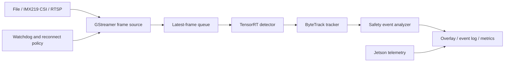

# Jetson Realtime Tracking System

A C++17 edge video analytics runtime for NVIDIA Jetson. The system combines
GStreamer video ingestion, TensorRT object detection, ByteTrack multi-object
tracking, rule-based safety event analysis, and device telemetry.

## Runtime Architecture



The file source provides deterministic replay for regression and benchmark
runs. The IMX219 CSI source is the primary live input. RTSP is used to verify
network-stream reconnect and fault-recovery behavior.

## Components

| Component | Responsibility | Status |
| --- | --- | --- |
| Runtime contracts | Frame, source, detector, and detection types | Implemented |
| GStreamer source | File replay and IMX219 CSI capture | Implemented |
| Capture pipeline | Dedicated producer thread, bounded queue, timestamps, and drop-oldest backpressure | Implemented |
| TensorRT runtime | Engine loading, CUDA buffers, and execution | Implemented |
| YOLOX detector | Preprocessing, TensorRT execution, grid decoding, confidence filtering, and NMS | Implemented |
| Continuous detection | Capture, bounded latest-frame queue, TensorRT detection, and latency statistics | Implemented |
| ByteTrack | Persistent track identities | Planned |
| Event analyzer | Region, dwell-time, and intrusion rules | Planned |
| Telemetry | FPS, latency, temperature, power, and memory | Planned |
| Recovery | Bounded CSI pipeline reconnect with explicit failure status | Implemented |
| Watchdog | Process supervision and RTSP recovery state machine | Planned |

## Build

```bash
cmake -S . -B build -DCMAKE_BUILD_TYPE=Release
cmake --build build -j"$(nproc)"
ctest --test-dir build --output-on-failure
./build/edge_vision_contract_check
./build/edge_vision_frame_queue_check
./build/edge_vision_preprocess_check
./build/edge_vision_postprocess_check
```

The default targets require a C++17 compiler and OpenCV. TensorRT targets are
enabled explicitly for Jetson builds.

Configure the GStreamer capture targets on Jetson with:

```bash
cmake -S . -B build \
  -DCMAKE_BUILD_TYPE=Release \
  -DEDGE_VISION_ENABLE_GSTREAMER=ON
cmake --build build -j"$(nproc)"

./build/edge_vision_capture_stream \
  --file input.mp4 --frames 300 --queue-capacity 4

./build/edge_vision_capture_stream \
  --csi --sensor-id 0 \
  --sensor-mode 4 \
  --capture-width 1280 --capture-height 720 --capture-fps 60 \
  --width 1280 --height 720 --fps 30 \
  --frames 300 --queue-capacity 4 \
  --reconnect-attempts 3 --reconnect-delay-ms 1000
```

The capture worker runs the source on a dedicated producer thread. Its bounded
queue drops the oldest frame when the consumer falls behind, keeping memory
bounded and prioritizing fresh frames for realtime analytics. Set
`--consumer-delay-ms` to create a controlled overload and inspect queue depth,
dropped frames, sequence gaps, and queue residence time.

CSI capture and application output rates are configured independently. For the
IMX219, the command above selects native sensor mode 4 at 1280x720/60 FPS and
uses `videorate` to deliver 30 FPS to the application. Unexpected EOS triggers
a bounded pipeline reopen sequence. If the requested frame count is not
reached after all attempts, the process reports recovery statistics and exits
with a nonzero status.

Configure the TensorRT runtime on Jetson and execute an engine probe with:

```bash
cmake -S . -B build \
  -DCMAKE_BUILD_TYPE=Release \
  -DEDGE_VISION_ENABLE_TENSORRT=ON
cmake --build build -j"$(nproc)"
./build/edge_vision_trt_probe models/yolox_nano_fp16.plan
./build/edge_vision_detect_image \
  models/yolox_nano_fp16.plan input.jpg output.jpg
```

Configure both runtime backends to run continuous detection from a replay file
or the IMX219 camera:

```bash
cmake -S . -B build \
  -DCMAKE_BUILD_TYPE=Release \
  -DEDGE_VISION_ENABLE_GSTREAMER=ON \
  -DEDGE_VISION_ENABLE_TENSORRT=ON
cmake --build build -j"$(nproc)"

./build/edge_vision_realtime_detect \
  --engine models/yolox_nano_fp16.plan \
  --file input.mp4 \
  --frames 300 \
  --queue-capacity 2

./build/edge_vision_realtime_detect \
  --engine models/yolox_nano_fp16.plan \
  --csi --sensor-id 0 \
  --sensor-mode 4 \
  --capture-width 1280 --capture-height 720 --capture-fps 60 \
  --width 1280 --height 720 --fps 30 \
  --frames 300 \
  --queue-capacity 2 \
  --reconnect-attempts 3 --reconnect-delay-ms 1000
```

The runtime reports produced, processed, and dropped frames; queue depth and
sequence gaps; detection counts; queue-wait, inference, and end-to-end P50/P95
latencies; and effective throughput. A small queue bounds stale-frame delay
when capture outpaces inference.

## Target Platform

- NVIDIA Jetson Orin Nano 8GB
- JetPack 6.2.1 / Ubuntu 22.04
- CUDA 12.6 / TensorRT 10.3
- C++17 / CMake 3.22+
- OpenCV 4.5+
- GStreamer 1.20+
- IMX219 CSI camera

## Model Artifacts

Model artifacts and TensorRT engines are generated outside the repository.
TensorRT engines must be built on the target Jetson because they are coupled
to the target GPU, TensorRT version, and optimization profile.

The detector baseline uses the official YOLOX-Nano ONNX export with a fixed
`1x3x416x416` input. Download and verify it with:

```bash
bash scripts/fetch_yolox_nano.sh
```

The source URL, checksum, license, and tensor contract are recorded in
`models/yolox_nano.json`.

## License

Project source code is released under the MIT License. See
`THIRD_PARTY_NOTICES.md` for upstream component licenses.
