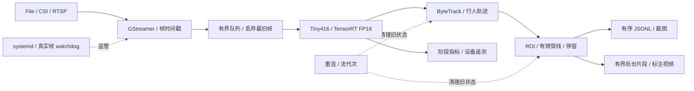

# Jetson 实时跟踪与安全事件分析系统

[](https://github.com/Nefelibata134/jetson-realtime-tracking-system/actions/workflows/ci.yml)
[](LICENSE)

面向 NVIDIA Jetson Orin Nano 的单路 C++17 行人跟踪与事件分析系统。接入文件、IMX219 CSI
或 H.264 RTSP，以 TensorRT FP16 检测和 ByteTrack 跟踪驱动 **ROI 入侵、有限方向穿线、停留**
三类规则，输出事件日志、截图、片段和运行指标。

**当前默认：YOLOX-Tiny416。** Nano 是历史基线；Tiny640、YOLOX-S、YOLO26n/s 是候选。
三类事件的实现已具备，但事件质量和最终部署配置的完整验收仍未完成。

[当前部署](#当前部署) · [实测与模型选择](#实测与模型选择) · [快速开始](#jetson-快速开始) ·
[模型资产与开发证据](#模型资产) · [服务运维](docs/operations/headless_service.md)

## 当前部署

| 项目 | 当前配置 |
| --- | --- |
| 平台 | Jetson Orin Nano 8GB；已记录软件基线见下方，部署时须核对目标设备 |
| 检测器 | YOLOX-Tiny，静态输入 `1×3×416×416`，TensorRT FP16 |
| 服务 engine | `/var/lib/edge-vision/models/yolox_tiny_fp16.plan` |
| CSI 输入 | IMX219 模式 4：1280×720 / 60 FPS 采集 → 30 FPS 交付 |
| 运行策略 | 25W / 动态调频；服务不自动切功率或执行 `jetson_clocks` |
| 服务阈值 | score 0.30、NMS 0.45、track 0.50、new-track 0.60；track buffer 30 帧 |
| 事件配置 | 实测设备启用 ROI、3秒停留、有限线0.2秒确认与共享片段；基础示例保留兼容行为 |

`416` 是检测网络输入尺寸，不是摄像头分辨率。服务配置与 calibration 评估阈值是不同配置，
不可混用其指标。默认项以[服务配置](deploy/systemd/edge-vision.env.example)和
[启动器](scripts/run_edge_vision_service.sh)为准；仓库默认不证明某台设备当前已经部署成功。
可选[事件证据配置](deploy/systemd/event-evidence.env.example)只保存JSONL、截图和片段，不开启全程录像。
实测设备已完成该配置的程序/参数/engine哈希及新增真实帧核验；这是部署健康检查通过，
不是事件准确率或60分钟稳定性验收通过。见[部署记录与限制](docs/benchmarks/tiny416_event_runtime_25w.md#部署与剩余验证)。

## 运行时架构



- **输入新鲜度：** 实时拥塞时丢弃最旧待处理帧；完整帧质量回放使用独立入口，不混用统计口径。
- **轨迹与事件：** 使用框底边中心和视频时间戳；重连后清理旧轨迹与事件状态。
- **证据输出：** JSONL/截图保持顺序；片段与标注视频异步编码，分别记录同步 I/O、后台编码和停止刷新。
- **故障恢复：** watchdog 依据真实解码帧增长，而非进程存活；RTSP/CSI 重连有超时与次数上限。

详细接口和 File / CSI / RTSP 命令见[运行与评估手册](docs/runtime_guide.md)。

## 实测与模型选择

### Tiny416：25W 动态调频事件短测

在 CSI 720p、真实人物活动、截图/共享事件片段及全程 x264 标注录像负载下，
300帧预热后测量9000帧：**30.0013 FPS，TRT P95 12.65 ms，E2E P95 23.11 ms**，
正式采集/录像丢帧和序列缺口均为0；预热丢弃7帧单列。
32条事件都有截图，25个物理片段覆盖全部事件。该结果不等于事件准确率或长期稳定性通过：
回顾性复核确认11条错误报警，完整真值不足，未计算事件P/R/F1；60分钟验证尚未完成。
详见[协议、计时边界与限制](docs/benchmarks/tiny416_event_runtime_25w.md)。
长期事件证据配置不启用全程录像，且不以这次短测宣称性能优于旧服务。

### Tiny416 与 Tiny640：CSI 720p 短测

以下两组均为 **MAXN_SUPER + jetson_clocks**，60 FPS 采集、30 FPS 交付，
每组预热 300 帧、测量 3,600 帧，启用 x264、截图与事件片段。

| 模型 | 有效 FPS | TRT P95 | E2E P95 | 采集丢帧 / 序列缺口 / 视频丢帧 | 标注帧写入 | 事件 / 截图 / 片段 |
| --- | ---: | ---: | ---: | --- | --- | --- |
| Tiny416 | 30.007089 | 3.87 ms | 8.77 ms | 0 / 0 / 0 | 3600/3600 | 4 / 4 / 4 |
| Tiny640 | 30.006253 | 7.09 ms | 11.50 ms | 0 / 0 / 0 | 3600/3600 | 5 / 5 / 5 |

两者在该短测负载下达到约 30 FPS，**不代表 25W 默认服务性能、充足余量或长期稳定通过**。
人物动作不完全一致，Tiny416 未出现穿线，测试窗口 OC3 保护计数增加 1；
完整同负载 A/B 未通过。预热丢弃另计为 6/5 帧。
E2E 计时到同步事件 I/O 与视频入队，不含传感器曝光、后台编码落盘或停止 flush。
逐阶段延迟、功耗、温度及恢复证据见[带事件 CSI 复测](docs/benchmarks/tiny_resolution_csi_event_retest.md)。

### 为什么默认仍是 Tiny416

| 同条件开发对照 | Nano | Tiny416 | 取舍 |
| --- | ---: | ---: | --- |
| MOT17 calibration HOTA / IDF1 / MOTA | 29.19 / 34.50 / 24.38 | 33.31 / 39.80 / 29.65 | 整体质量改善；IDSW 从 227 增至 232 |
| CAVIAR development TP / FP / FN | 4 / 4 / 5 | 4 / 2 / 5 | 误报减少；穿线少检出一次，停留多检出一次 |
| 同轮 CAVIAR development F1 | 47.06% | 53.33% | 仅 9 项参考事件，不是独立外部验收 |

Tiny416 固定 MOT17 留出成绩为 **HOTA 38.89、IDF1 46.75、MOTA 39.19**；
留出与 calibration 不合并。Tiny640 提高了 MOT17 召回，但未形成一致的事件质量收益，
因此不替换默认模型。依据见[MOT17 结果](docs/benchmarks/mot17_tracking_results.md)、
[历史 CAVIAR 模型对照](docs/benchmarks/caviar_detector_development_comparison.md)。

Nano 的八组性能矩阵、60 分钟稳定性和恢复记录保留为历史基线，不能改名为 Tiny 的结果：
[历史矩阵](docs/benchmarks/jetson_full_pipeline_matrix.md) ·
[完整矩阵摘录与复现入口](docs/runtime_guide.md#历史性能证据) ·
[稳定性报告](docs/operations/stability_report.md)。

## Jetson 快速开始

适用于已具备匹配 CUDA/TensorRT 的目标 Jetson。先核对软件栈与依赖安装计划；不要用系统升级代替应用依赖配置。
在全新部署中获取已校验的 Tiny416 ONNX，再在目标设备构建 engine：

```bash
sudo apt-get update
sudo apt-get install -y \
  git curl cmake g++ pkg-config libopencv-dev libeigen3-dev nlohmann-json3-dev \
  libgstreamer1.0-dev libgstreamer-plugins-base1.0-dev \
  gstreamer1.0-plugins-good gstreamer1.0-plugins-bad \
  gstreamer1.0-plugins-ugly gstreamer1.0-tools

git clone https://github.com/Nefelibata134/jetson-realtime-tracking-system.git
cd jetson-realtime-tracking-system

bash scripts/fetch_yolox_tiny.sh
bash scripts/build_tensorrt_engine.sh \
  models/yolox_tiny.onnx models/yolox_tiny_fp16.plan

cmake -S . -B build \
  -DCMAKE_BUILD_TYPE=Release \
  -DEDGE_VISION_ENABLE_GSTREAMER=ON \
  -DEDGE_VISION_ENABLE_TENSORRT=ON
cmake --build build -j"$(nproc)"
ctest --test-dir build --output-on-failure
```

执行一次有限 IMX219 验证并原子发布指标。已运行摄像头服务时，不要同时启动第二个 CSI 进程；
应先安排停服与退出恢复窗口。此命令仅验证基础链路，不启用事件规则或媒体输出：

```bash
./build/edge_vision_realtime_detect \
  --engine models/yolox_tiny_fp16.plan \
  --csi --sensor-id 0 --sensor-mode 4 \
  --capture-width 1280 --capture-height 720 --capture-fps 60 \
  --width 1280 --height 720 --fps 30 \
  --warmup-frames 30 --frames 300 --queue-capacity 2 \
  --score-threshold 0.3 \
  --track-threshold 0.5 --new-track-threshold 0.6 --track-buffer 30 \
  --metrics-json outputs/metrics/imx219.json
```

TensorRT plan 与硬件及软件栈耦合，不从其他设备直接复制使用。正式服务安装、环境配置、
启停与恢复见[服务运维指南](docs/operations/headless_service.md)；完整事件与媒体命令见
[运行手册](docs/runtime_guide.md#构建与运行)。切换 engine 后应核对实际进程参数、文件哈希、
服务状态、重启计数及新增真实帧，不能只凭 `active` 判断完成。

## 模型资产

仓库只跟踪获取/导出/构建工具、模型元数据和校验和，不分发权重、ONNX 或 TensorRT engine。
官方 Nano/Tiny416/S ONNX 获取入口：

```bash
bash scripts/fetch_yolox_nano.sh
bash scripts/fetch_yolox_tiny.sh
bash scripts/fetch_yolox_s.sh
```

来源、哈希和输入输出契约见 [Nano](models/yolox_nano.json)、
[Tiny416](models/yolox_tiny.json)、[S](models/yolox_s.json)。
Tiny640 的同权重导出与 416 等价检查见[资产契约](docs/models/yolox_tiny_640.md)。
YOLO26n/s 共用独立导出与 Detector 适配，保留为显式候选，分别见
[YOLO26n](docs/models/yolo26n.md)、[YOLO26s](docs/models/yolo26s.md)；
其输出不复用 YOLOX 网格解码。导出或最小推理成功均不等于部署验收。

### 开发证据

| 验证范围 | 核心结果与限制 | 证据 |
| --- | --- | --- |
| v1：25W，同阈值 MOT17 calibration | Tiny640 Recall 47.06% 对 Tiny416 34.14%，但 IDSW 352 对 232，小目标中断增加；原质量门槛 FAIL | [协议](docs/benchmarks/tiny_resolution_protocol.md) · [结果](docs/benchmarks/tiny_resolution_results.md) |
| v2：MAXN_SUPER 锁频 CSI 720p | 首轮数值实时性达标但无事件，完整链路门槛 FAIL；带事件复测仍不满足同负载 A/B | [首轮](docs/benchmarks/tiny_resolution_development_v2_results.md) · [带事件复测](docs/benchmarks/tiny_resolution_csi_event_retest.md) |
| v3：27 组有界 calibration 参数搜索 | 没有配置满足该轮全部无回退条件；完整矩阵保留覆盖、误报、IDSW 和中断取舍 | [参数矩阵与结论](docs/benchmarks/tiny_resolution_tuning_v3_results.md) |
| v4：四组 CAVIAR development | Tiny416 / 未调参 Tiny640 / 两组调参 Tiny640 的 F1 为 58.82% / 42.11% / 38.10% / 42.11%；640 穿线漏报和 ROI 误报更多 | [同 GT 连续性](docs/benchmarks/tiny_resolution_continuity_v4_results.md) · [事件结果](docs/benchmarks/tiny_resolution_caviar_v4_results.md) |
| v5：VIRAT 同源原生 720p / 384×216 | 原生输入两模型 F1 均 66.67%，低清分别 66.67% / 70.59%；未证实原生清晰度带来更大 640 收益 | [源分辨率对照](docs/benchmarks/tiny_source_resolution_v5_results.md) |
| v6：MEVA 近景，派生 720p | Tiny416 / Tiny640 为 13/8/1 与 13/9/1（TP/FP/FN），F1 74.29% / 72.22%；640 没有新增正确事件 | [协议](docs/benchmarks/tiny_near_field_v6.md) · [逐类结果与诊断](docs/benchmarks/tiny_near_field_v6_results.md) |


v4 阈值不同于历史 Nano/Tiny/S 对照，不能把跨轮差异单独归因于模型。
v5/v6 为顺序 PNG 开发回放，不是 CSI 实时性测试；v6 三段来自同机位同源视频，
1920×1072 补边缩至 1280×720，源 PTS 缺失，使用明确标记的派生时间，**不是原生 720p**。
全部开发结果均不能替代新的独立外部验证，原协议门槛与 FAIL 保留。

## 已知限制与验收缺口

- **事件质量：** 近景仍有重复 ROI 误报和遮挡后的底边锚点问题；v6 三项停留全对不代表普遍可靠。
  历史 Nano CAVIAR 外部留出 F1 40.00% 为 FAIL，不是 Tiny 的留出结果。
- **部署一致性：** 需要在最终服务阈值和场景规则下，完成真实三类事件负载的 CSI 720p/30 完整输出验证。
- **长期运行：** 最终 Tiny 配置至少 60 分钟持续运行与故障恢复证据待补；Nano 历史结果不直接沿用。
- **证据边界：** 回放速度不替代 CSI FPS；缺失的 E2E 或事件 I/O 保持 N/A，不从阶段 P95 相加推算。
- **公开资产：** 视频、截图、标注、逐帧输出、运行日志、模型与凭据不纳入 Git。
  运行产物写入 `outputs/` 或服务 spool，按场景授权和保留策略管理。

## 文档与验证入口

| 需求 | 入口 |
| --- | --- |
| 构建、File / CSI / RTSP、事件与编码参数 | [运行与评估手册](docs/runtime_guide.md) |
| systemd、spool、日志和真实帧 watchdog | [服务运维](docs/operations/headless_service.md) · [恢复验证](docs/operations/stability_validation.md) |
| 指标定义、事件格式和证据时序 | [运行指标 Schema](docs/metrics/runtime_metrics_schema.md) · [事件 Schema](docs/events/event_schema.md) |
| MOT17 固定划分与 TrackEval | [协议](docs/benchmarks/mot17_evaluation_protocol.md) · [结果](docs/benchmarks/mot17_tracking_results.md) |
| CAVIAR 冻结规则和历史外部验证 | [协议](docs/benchmarks/caviar_external_validation_protocol.md) · [结果](docs/benchmarks/caviar_external_validation_results.md) |
| 架构、模型与功率取舍 | [工程决策](docs/decisions.md) |
| 变更与发布边界 | [CHANGELOG](CHANGELOG.md) · [第三方声明](THIRD_PARTY_NOTICES.md) |

已记录目标软件基线：JetPack 6.2.1 / Ubuntu 22.04、CUDA 12.6 / TensorRT 10.3、
C++17 / CMake 3.22+、OpenCV 4.5+、GStreamer 1.20+。实际设备版本需部署时核验。
主机可执行 CTest 与 Python 确定性检查，但不覆盖目标 TensorRT 链接、设备推理或 CSI 性能。

## 许可证

从许可证迁移提交开始，项目自有源码及包含兼容第三方组件的整体项目分发按
[`AGPL-3.0-only`](LICENSE)（GNU Affero General Public License v3.0 only）提供，
并须满足其相应源码提供与分发义务。第三方文件本身未被重新许可，原始许可证和版权声明
继续保留；这不豁免整体组合程序的 AGPL 发布条件。
截至并包括提交 `d790926b0187d27b1f5f5607f1ef709c909eaf7f` 的历史版本仍按其当时的
MIT License 授权，既有授权不作追溯变更。范围、源码提供义务和二进制发布边界见
[许可证与发布边界](docs/licensing.md)，第三方组件及资产的原始许可见
[第三方声明](THIRD_PARTY_NOTICES.md)。

CUDA/TensorRT 等外部专有依赖不随本仓库分发。未来发布项目二进制、容器或捆绑运行库前，
必须重新审计实际组合及其许可兼容性；当前源码发布不构成二进制分发授权。
