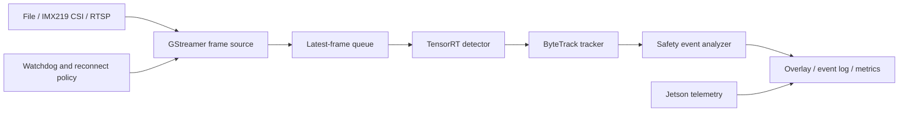

# Jetson Realtime Tracking System

A C++17 edge video analytics runtime for NVIDIA Jetson. The system combines
GStreamer video ingestion, TensorRT object detection, ByteTrack multi-object
tracking, rule-based safety event analysis, and device telemetry.

## Runtime Architecture



The file source provides deterministic replay for regression and benchmark
runs. The IMX219 CSI source is the primary live input. RTSP is used to verify
network-stream reconnect and fault-recovery behavior.

## Components

| Component | Responsibility | Status |
| --- | --- | --- |
| Runtime contracts | Frame, source, detector, and detection types | Implemented |
| GStreamer source | File replay and IMX219 CSI capture | In progress |
| TensorRT runtime | Engine loading, CUDA buffers, and execution | Implemented |
| YOLOX detector | Preprocessing, decoding, and NMS | In progress |
| ByteTrack | Persistent track identities | Planned |
| Event analyzer | Region, dwell-time, and intrusion rules | Planned |
| Telemetry | FPS, latency, temperature, power, and memory | Planned |
| Recovery | Stream reconnect and watchdog state machine | Planned |

## Build

```bash
cmake -S . -B build -DCMAKE_BUILD_TYPE=Release
cmake --build build -j"$(nproc)"
ctest --test-dir build --output-on-failure
./build/edge_vision_contract_check
```

The contract target requires only a C++17 compiler. Jetson runtime targets are
enabled as their GStreamer and TensorRT implementations are added.

Configure the TensorRT runtime on Jetson and execute an engine probe with:

```bash
cmake -S . -B build \
  -DCMAKE_BUILD_TYPE=Release \
  -DEDGE_VISION_ENABLE_TENSORRT=ON
cmake --build build -j"$(nproc)"
./build/edge_vision_trt_probe models/yolox_nano_fp16.plan
```

## Target Platform

- NVIDIA Jetson Orin Nano 8GB
- JetPack 6.2.1 / Ubuntu 22.04
- CUDA 12.6 / TensorRT 10.3
- C++17 / CMake 3.22+
- GStreamer 1.20+
- IMX219 CSI camera

## Model Artifacts

Model artifacts and TensorRT engines are generated outside the repository.
TensorRT engines must be built on the target Jetson because they are coupled
to the target GPU, TensorRT version, and optimization profile.

The detector baseline uses the official YOLOX-Nano ONNX export with a fixed
`1x3x416x416` input. Download and verify it with:

```bash
bash scripts/fetch_yolox_nano.sh
```

The source URL, checksum, license, and tensor contract are recorded in
`models/yolox_nano.json`.

## License

Project source code is released under the MIT License. See
`THIRD_PARTY_NOTICES.md` for upstream component licenses.
