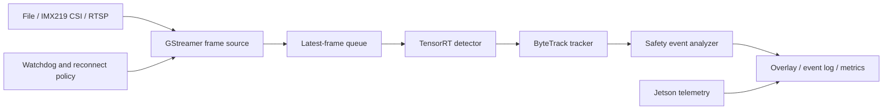

# Jetson Realtime Tracking System

A C++17 edge video analytics runtime for NVIDIA Jetson. The system combines
GStreamer video ingestion, TensorRT object detection, ByteTrack multi-object
tracking, rule-based safety event analysis, and device telemetry.

## Runtime Architecture



The file source provides deterministic replay for regression and benchmark
runs. The IMX219 CSI source is the primary live input. RTSP is used to verify
network-stream reconnect and fault-recovery behavior.

## Components

| Component | Responsibility | Status |
| --- | --- | --- |
| Runtime contracts | Frame, source, detector, and detection types | Implemented |
| GStreamer source | File replay and IMX219 CSI capture | Implemented |
| Capture pipeline | Dedicated producer thread, bounded queue, timestamps, and drop-oldest backpressure | Implemented |
| TensorRT runtime | Engine loading, CUDA buffers, and execution | Implemented |
| YOLOX detector | Preprocessing, TensorRT execution, grid decoding, confidence filtering, and NMS | Implemented |
| Continuous detection and tracking | Capture, bounded latest-frame queue, TensorRT detection, ByteTrack association, annotated video output, and latency statistics | Implemented |
| Benchmark harness | Warmup isolation, power telemetry, and model/resolution/power comparison | Implemented |
| ByteTrack | Kalman prediction, two-stage association, class-aware identities, and reset semantics | Implemented |
| Event analyzer | Region, dwell-time, and intrusion rules | Planned |
| Telemetry | FPS, latency, temperature, power, and memory | Planned |
| Recovery | Bounded CSI pipeline reconnect with explicit failure status | Implemented |
| Watchdog | Process supervision and RTSP recovery state machine | Planned |

## Build

```bash
cmake -S . -B build -DCMAKE_BUILD_TYPE=Release
cmake --build build -j"$(nproc)"
ctest --test-dir build --output-on-failure
./build/edge_vision_contract_check
./build/edge_vision_frame_queue_check
./build/edge_vision_preprocess_check
./build/edge_vision_postprocess_check
./build/edge_vision_byte_tracker_check
```

The default targets require a C++17 compiler, OpenCV, and Eigen 3. TensorRT
targets are enabled explicitly for Jetson builds.

Configure the GStreamer capture targets on Jetson with:

```bash
cmake -S . -B build \
  -DCMAKE_BUILD_TYPE=Release \
  -DEDGE_VISION_ENABLE_GSTREAMER=ON
cmake --build build -j"$(nproc)"

./build/edge_vision_capture_stream \
  --file input.mp4 --frames 300 --queue-capacity 4

./build/edge_vision_capture_stream \
  --csi --sensor-id 0 \
  --sensor-mode 4 \
  --capture-width 1280 --capture-height 720 --capture-fps 60 \
  --width 1280 --height 720 --fps 30 \
  --frames 300 --queue-capacity 4 \
  --reconnect-attempts 3 --reconnect-delay-ms 1000
```

The capture worker runs the source on a dedicated producer thread. Its bounded
queue drops the oldest frame when the consumer falls behind, keeping memory
bounded and prioritizing fresh frames for realtime analytics. Set
`--consumer-delay-ms` to create a controlled overload and inspect queue depth,
dropped frames, sequence gaps, and queue residence time.

CSI capture and application output rates are configured independently. For the
IMX219, the command above selects native sensor mode 4 at 1280x720/60 FPS and
uses `videorate` to deliver 30 FPS to the application. Unexpected EOS triggers
a bounded pipeline reopen sequence. If the requested frame count is not
reached after all attempts, the process reports recovery statistics and exits
with a nonzero status.

Configure the TensorRT runtime on Jetson and execute an engine probe with:

```bash
cmake -S . -B build \
  -DCMAKE_BUILD_TYPE=Release \
  -DEDGE_VISION_ENABLE_TENSORRT=ON
cmake --build build -j"$(nproc)"
./build/edge_vision_trt_probe models/yolox_nano_fp16.plan
./build/edge_vision_detect_image \
  models/yolox_nano_fp16.plan input.jpg output.jpg
```

Configure both runtime backends to run continuous detection from a replay file
or the IMX219 camera:

```bash
cmake -S . -B build \
  -DCMAKE_BUILD_TYPE=Release \
  -DEDGE_VISION_ENABLE_GSTREAMER=ON \
  -DEDGE_VISION_ENABLE_TENSORRT=ON
cmake --build build -j"$(nproc)"

./build/edge_vision_realtime_detect \
  --engine models/yolox_nano_fp16.plan \
  --file input.mp4 \
  --warmup-frames 30 \
  --frames 300 \
  --queue-capacity 2 \
  --score-threshold 0.3 \
  --track-threshold 0.5 \
  --new-track-threshold 0.6 \
  --track-buffer 30 \
  --output-video outputs/replay_tracking.mp4 \
  --output-queue-capacity 4

./build/edge_vision_realtime_detect \
  --engine models/yolox_nano_fp16.plan \
  --csi --sensor-id 0 \
  --sensor-mode 4 \
  --capture-width 1280 --capture-height 720 --capture-fps 60 \
  --width 1280 --height 720 --fps 30 \
  --warmup-frames 30 \
  --frames 300 \
  --queue-capacity 2 \
  --score-threshold 0.3 \
  --track-threshold 0.5 \
  --new-track-threshold 0.6 \
  --track-buffer 30 \
  --event-roi 0.20 0.35 0.80 0.95 \
  --event-dwell-seconds 3 \
  --event-line 0.15 0.70 0.85 0.70 \
  --event-line-direction any \
  --event-class-id 0 \
  --output-video outputs/imx219_tracking.mp4 \
  --output-queue-capacity 4 \
  --reconnect-attempts 3 --reconnect-delay-ms 1000
```

The runtime reports produced, processed, and dropped frames; queue depth and
sequence gaps; detection, track, and event counts; unique track IDs;
queue-wait, inference, tracking, event-analysis, and end-to-end P50/P95
latencies; and effective throughput. The detector score threshold must remain
below the ByteTrack track threshold so low-confidence detections remain
available for second-stage association. A small queue bounds stale-frame delay
when capture outpaces inference. Missing frame sequences age the tracker with
empty updates, while a successful source reconnect increments the stream
generation and clears all
stale tracks. Warmup frames execute the complete pipeline but are excluded
from detection, tracking, latency, throughput, and steady-state drop
statistics.

Safety rules are opt-in. `--event-roi` defines a normalized rectangular region
as `LEFT TOP RIGHT BOTTOM` and enables confirmed ROI intrusion events.
`--event-dwell-seconds` adds a timestamp-based dwell rule for the same region.
`--event-line` defines a finite normalized segment, while
`--event-line-direction` selects `any`, `negative-to-positive`, or
`positive-to-negative` crossing. Rules use each track's bottom-center anchor;
stream generation changes and timeline restarts clear all event state.

`--output-video` is optional. When enabled, the runtime sends measured frames
after warmup to a dedicated bounded writer queue and overlays each active
track's bounding box, bottom-center anchor, class ID, confidence, and persistent
track ID. Configured ROI and line geometry remain visible, while triggered
event labels and anchors persist briefly for review. Slow encoding drops the
oldest pending output frame instead of blocking capture, detection, or
tracking. Enqueue latency, writer drops, queue watermark, and final flush time
are reported separately from real-time pipeline latency.

Measured synchronous and asynchronous output results are available in the
[annotated video output benchmark](docs/benchmarks/annotated_video_output.md).

## Jetson Benchmark Matrix

The benchmark harness compares YOLOX-Nano and YOLOX-Tiny under 720p and 1080p
CSI capture in two Jetson power modes. Both detectors retain their fixed
`1x3x416x416` TensorRT input; capture resolution measures the upstream camera,
conversion, resize, and memory-transfer workload rather than changing the
model tensor contract.

Fetch the verified upstream exports, then build both FP16 engines on the target
Jetson:

```bash
bash scripts/fetch_yolox_nano.sh
bash scripts/fetch_yolox_tiny.sh

bash scripts/build_tensorrt_engine.sh \
  models/yolox_nano.onnx models/yolox_nano_fp16.plan
bash scripts/build_tensorrt_engine.sh \
  models/yolox_tiny.onnx models/yolox_tiny_fp16.plan
```

Build the runtime and inspect the power modes available on the device:

```bash
cmake -S . -B build-jetson-benchmark \
  -DCMAKE_BUILD_TYPE=Release \
  -DEDGE_VISION_ENABLE_GSTREAMER=ON \
  -DEDGE_VISION_ENABLE_TENSORRT=ON
cmake --build build-jetson-benchmark -j"$(nproc)"
ctest --test-dir build-jetson-benchmark --output-on-failure

sudo nvpmodel -q --verbose
```

Run one controlled group with the active power mode. Repeat the command for
`nano` and `tiny`, for `720p` and `1080p`, and after selecting each power mode
under comparison. The script records the active mode and never changes it.

```bash
bash scripts/run_jetson_benchmark.sh \
  --model nano \
  --engine models/yolox_nano_fp16.plan \
  --resolution 720p \
  --warmup-frames 30 \
  --frames 600
```

Raw runtime and `tegrastats` logs are kept under the ignored
`reports/benchmarks/raw/` directory. Generate the tracked comparison table
after all groups finish:

```bash
python3 scripts/summarize_jetson_benchmarks.py
```

The resulting CSV and Markdown files report steady-state FPS, inference and
end-to-end P95 latency, drop rate, mean and peak power, temperature, GPU
utilization, and FPS per watt.

## MOT17 Tracking Evaluation

The offline evaluation path processes every selected MOT17 frame in sequence,
exports standard ten-column MOTChallenge result files, and computes HOTA,
IDF1, MOTA, and identity switches with a pinned official TrackEval revision.
Only the FRCNN-named copy of each physical MOT17 video is used because this
runtime supplies its own detector outputs. The fixed partition uses public
training sequences only, and each command validates metadata, ground truth,
image count, and frame numbering before starting inference.

```bash
bash scripts/fetch_mot17.sh
bash scripts/fetch_trackeval.sh

cmake -S . -B build-mot17 \
  -DCMAKE_BUILD_TYPE=Release \
  -DEDGE_VISION_ENABLE_TENSORRT=ON
cmake --build build-mot17 -j"$(nproc)"

bash scripts/run_mot17_inference.sh \
  --engine models/yolox_tiny_fp16.plan \
  --seqmap configs/mot17/holdout.txt \
  --output-root outputs/mot17/holdout/final_tiny/edge_vision/data \
  --report-root reports/mot17/holdout/final_tiny/inference \
  --score-threshold 0.10 \
  --nms-threshold 0.45 \
  --track-threshold 0.30 \
  --new-track-threshold 0.40 \
  --match-threshold 0.80 \
  --track-buffer 30

bash scripts/run_trackeval_mot17.sh \
  --python /usr/bin/python3 \
  --seqmap configs/mot17/holdout.txt \
  --tracker-root outputs/mot17/holdout/final_tiny \
  --tracker-name edge_vision \
  --output-root reports/mot17/holdout/final_tiny/trackeval
```

The fixed YOLOX-Tiny FP16 configuration achieved **38.89 HOTA**, **46.75
IDF1**, and **39.19 MOTA** on the three-sequence holdout partition. TensorRT
inference P95 was 13.98-14.07 ms across the sequences, while ByteTrack P95
remained below 0.32 ms.

The fixed calibration/holdout partition, frame policy, dependency versions,
and report generation commands are defined in the
[MOT17 evaluation protocol](docs/benchmarks/mot17_evaluation_protocol.md).
The detector comparison and final holdout metrics are recorded in the
[MOT17 tracking results](docs/benchmarks/mot17_tracking_results.md).

## Target Platform

- NVIDIA Jetson Orin Nano 8GB
- JetPack 6.2.1 / Ubuntu 22.04
- CUDA 12.6 / TensorRT 10.3
- C++17 / CMake 3.22+
- OpenCV 4.5+
- GStreamer 1.20+
- IMX219 CSI camera

## Model Artifacts

Model artifacts and TensorRT engines are generated outside the repository.
TensorRT engines must be built on the target Jetson because they are coupled
to the target GPU, TensorRT version, and optimization profile.

The detector comparison uses the official YOLOX-Nano and YOLOX-Tiny ONNX
exports with fixed `1x3x416x416` inputs. Download and verify them with:

```bash
bash scripts/fetch_yolox_nano.sh
bash scripts/fetch_yolox_tiny.sh
```

The source URL, checksum, license, and tensor contract are recorded in
`models/yolox_nano.json` and `models/yolox_tiny.json`.

## License

Project source code is released under the MIT License. See
`THIRD_PARTY_NOTICES.md` for upstream component licenses.
