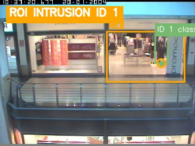
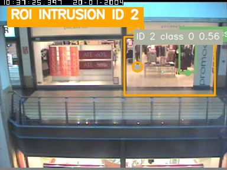
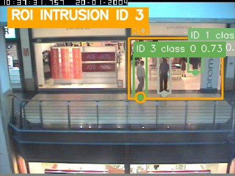
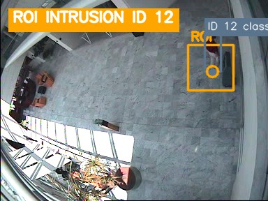

# CAVIAR 公开场景外部事件验证结果

## 结论

**正式事件精度门禁：FAIL。**

系统在 Jetson Orin Nano 8GB 的 25W 锁定时钟模式下，以 RTSP 实时回放完成四段留出视频：
共处理 `4,310/4,310` 帧，输入丢帧为 `0`，帧序缺口为 `0`，四段均达到目标帧数。运行时和
证据链有效，但三个正样本序列都没有同时达到预先固定的 `Precision >= 0.80` 与
`Recall >= 0.80`。

三个正样本合计有 7 个真值事件，系统在对应事件类型下产生 3 个可计分事件：

- TP `2`、FP `1`、FN `5`。
- 聚合 Precision `66.67%`、Recall `28.57%`、F1 `40.00%`。
- 零事件负样本 `Browse_WhileWaiting2` 未产生停留误报，单独通过。
- 运行时实际生成 4 条事件，4 张截图和 4 个事件片段全部完成，证据完整率为 `100%`。

这组结果证明实时输入、TensorRT、ByteTrack、事件规则、截图、片段和标注视频能够在真实
公开视频上端到端运行；它不证明当前 YOLOX-Nano 配置已达到可部署的外部事件精度。

## 被测配置

| 项目 | 数值 |
| --- | --- |
| 平台 | NVIDIA Jetson Orin Nano 8GB |
| 系统 | JetPack 6.2.1 / Ubuntu 22.04 |
| 功率模式 | 25W，模式 1，锁定时钟 |
| 输入 | CAVIAR 384x288、25 FPS，经 H.264 MP4 本机 RTSP 实时回放 |
| 检测器 | YOLOX-Nano，416x416，TensorRT FP16 |
| 测试提交 | `c1c47e5fa9265d4647a23f243bceeb2e5dfe902a` |
| engine SHA-256 | `59ef6ba75427881aa9fd70967e0ea44b94646e126a9070c4c6f2a9c2d43371bf` |
| 规则 | `configs/caviar/rules.frozen.json` |
| 匹配门限 | 50 帧、归一化锚点距离 0.20，穿线方向必须一致 |

本轮只适用于上述 Nano engine，不能代替 MOT17 文档中 YOLOX-Tiny 的独立结果。

## 逐段结果

| 状态 | 序列 | 角色 | 事件 | 真值 | 可计分输出 | 未计分输出 | TP/FP/FN | Precision | Recall | F1 |
| --- | --- | --- | --- | ---: | ---: | ---: | ---: | ---: | ---: | ---: |
| FAIL | `Walk2` | 正样本 | 双向穿线 | 3 | 0 | 0 | 0/0/3 | 不适用 | 0.00% | 0.00% |
| PASS | `Browse_WhileWaiting2` | 零事件负样本 | 停留 | 0 | 0 | 0 | 0/0/0 | 不适用 | 不适用 | 不适用 |
| FAIL | `Browse2` | 正样本 | 停留 | 1 | 0 | 1 | 0/0/1 | 不适用 | 0.00% | 0.00% |
| FAIL | `EnterExitCrossingPaths2front` | 正样本 | ROI 入侵 | 3 | 3 | 0 | 2/1/1 | 66.67% | 66.67% | 66.67% |

评估器为了避免除零，在“没有可计分输出”时将原始 Precision 记为 `1.0`；上表显示为
“不适用”，避免把零预测误解为高精度。负样本的 PASS 只表示没有停留误报，不表示系统
具备停留召回能力。`Browse2` 的 1 条未计分输出是 `roi_intrusion`，不属于该序列冻结的
`dwell` 计分类型。

完整数值保存在
[`caviar_external_validation_results.csv`](caviar_external_validation_results.csv)。

## 运行时有效性

| 序列 | 处理/目标帧 | 丢帧 | 缺口 | FPS | 检测帧 | 检测数 | 跟踪帧 | 轨迹观测 | TRT P95 | E2E P95 |
| --- | ---: | ---: | ---: | ---: | ---: | ---: | ---: | ---: | ---: | ---: |
| `Walk2` | 1055/1055 | 0 | 0 | 25.11 | 490 | 557 | 8 | 8 | 3.39 ms | 5.37 ms |
| `Browse_WhileWaiting2` | 1895/1895 | 0 | 0 | 25.05 | 644 | 653 | 88 | 88 | 3.37 ms | 5.45 ms |
| `Browse2` | 875/875 | 0 | 0 | 25.11 | 607 | 772 | 118 | 118 | 3.37 ms | 5.47 ms |
| `EnterExitCrossingPaths2front` | 485/485 | 0 | 0 | 25.28 | 465 | 1650 | 415 | 752 | 3.37 ms | 5.71 ms |

TRT P95 为 `3.37–3.39 ms`，端到端 P95 为 `5.37–5.71 ms`，明显低于 25 FPS 的
`40 ms` 帧预算；平均输入功率约 `6.92 W`，GPU 最高温度为 `54.19 C`。因此本轮主要限制
不是推理吞吐，而是小目标检测转化为稳定轨迹的比例。

`Walk2` 有 557 次检测，却只有 8 次轨迹观测，无法形成穿线轨迹；`Browse2` 有 772 次
检测和 118 次轨迹观测，但没有任何轨迹在冻结 ROI 内连续保持 3 秒。入口视频中的人物更大，
形成 752 次轨迹观测，因此命中 2 个事件，但仍漏掉 1 名启动占用人员并产生 1 次假进入。

## 事件证据

入口视频中的两次真阳性和一次假阳性均生成了截图与事件片段：

| 启动占用 TP，第 5 帧 | FP，第 124 帧 | 后续进入 TP，第 282 帧 |
| --- | --- | --- |
|  |  |  |

`Browse2` 在第 783 帧生成了 ROI 进入证据，但它不是 3 秒停留事件，因此不参与停留得分：

截图来源与授权边界见
[`docs/assets/caviar_external/README.md`](../assets/caviar_external/README.md)。

## 测量完整性

第一次执行使用容量为 2 的输入队列，四段分别出现 `2/3/2/2` 个丢帧，因而全部作废并保留
原始目录。提交 `c1c47e5` 只将队列容量提高到 8，以吸收首帧 TensorRT 冷启动；模型、
engine、检测/跟踪阈值、事件几何、真值和匹配规则均未改变。本页只汇总修复后满足
`dropped_total=0`、`sequence_gaps=0`、`target_reached=true` 的四个目录：

- `Walk2-20260901T154346Z`
- `Browse_WhileWaiting2-20260901T154631Z`
- `Browse2-20260901T154816Z`
- `EnterExitCrossingPaths2front-20260901T155001Z`

运行日志还打印了 TensorRT engine 跨设备型号使用警告。该警告不改变本轮已经观测到的
帧数与事件结果，但限制性能结果的可移植性；下一轮应在准确目标设备上重新构建 engine 并
记录新哈希。

## 后续边界

当前 CAVIAR 留出视频已经解锁并产生过系统结果，不能再次宣称为从未查看的独立留出集。
若后续在开发视频上更换 YOLOX-Tiny、调整检测/跟踪阈值或采用 ROI 裁剪，应选择新的公开
视频并重新冻结为下一轮留出集。本轮 FAIL 必须保留，不能被后续结果覆盖。

完整数据划分、人工复核、真值生成和通过门限见
[`CAVIAR 公开场景外部事件验证协议`](caviar_external_validation_protocol.md)。

## 数据归属

源视频和人工框来自 EC Funded CAVIAR project/IST 2001 37540，数据页面标示为 CC BY-SA。
仓库不重新分发原视频或 XML；本页中的派生截图按相同署名与共享方式要求提供。
